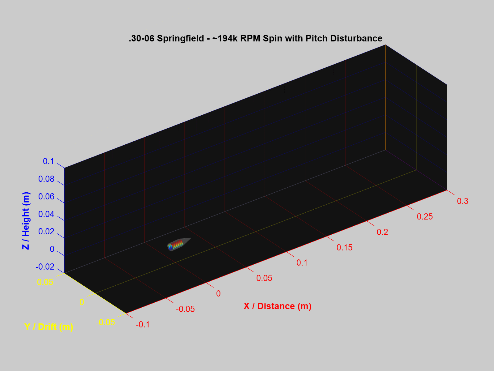

# .30-06 Springfield (Cartridge, Caliber .30, Ball, M2) 6-DOF Kinematic Simulation

A 3D numerical visualization in MATLAB modeling the muzzle velocity, axial spin stabilization, and barrel-exit epicyclic nutation (pitch and yaw oscillation) of a WWII-standard .30-06 Springfield M2 Ball projectile.

## Simulation Animation


## Overview
This project simulates the high-speed departure kinematics of an M2 Ball round departing a standard 1:10" right-hand twist barrel (such as the M1 Garand or M1903 Springfield). It captures the transition from interior ballistics to free flight by combining forward translation, ultra-high axial spin, and transient epicyclic swerve caused by muzzle blast separation.

## Technical Specifications & Sourced Parameters

Physical dimensions and initial kinematic states are referenced directly from U.S. Army technical documentation:

> **Primary Source:**  
> Headquarters, Department of the Army, *TM 43-0001-27: Army Ammunition Data Sheets - Small Arms Ammunition*, Chapter 5, Page 5-9 ("Cartridge, Caliber .30, Ball, M2").

### Kinematic & Ballistic Properties
- **Projectile Type**: Caliber .30, Ball, M2 (150–152 grain, flat base)
- **Reference Velocity ($v_0$)**: $2{,}740\text{ ft/s}$ ($835.15\text{ m/s}$) measured at $78\text{ ft}$ ($23.77\text{ m}$) from muzzle
- **Barrel Twist Rate**: $1\text{ turn in } 10\text{ inches}$ ($1:0.254\text{ m}$)
- **Axial Spin Rate**:
  $$\text{RPS} = \frac{v_0}{\text{Twist}} = \frac{835.15\text{ m/s}}{0.254\text{ m}} \approx 3{,}288\text{ rev/s} \implies \approx 197{,}280\text{ RPM}$$
- **Time Resolution ($\Delta t$)**: $50\ \mu\text{s}$ discrete integration intervals
- **Nutation Frequency**: $1500\text{ rad/s}$ high-frequency transient wobble

### Projectile Geometry
- **Groove/Bore Radius ($r$)**: $3.91\text{ mm}$ ($0.308\text{ in}$ diameter)
- **Cylindrical Bearing Length ($L_{\text{body}}$)**: $13.7\text{ mm}$
- **Tangent Ogive Nose ($L_{\text{nose}}$)**: $14.0\text{ mm}$ (approx. 7-caliber ogive profile)
- **Total Projectile Length**: $27.7\text{ mm}$

## Features
- **Parametric 3D Geometry**: Reconstructs the M2 Ball profile using cylindrical shank and conical/ogival nose surface matrices shifted to center-of-gravity.
- **Hardware-Accelerated Animation**: Implements MATLAB `hgtransform` objects to apply combined translation and 3-axis rotation transforms without recreating plot handles.
- **Dynamic Camera Tracking**: Moves viewing bounds synchronously along the $X$-axis to follow the high-speed projectile in flight.
- **Integrated GIF Export**: Automatically compiles figure frames using indexed color palettes and saves `bullet_animation.gif`.

## Getting Started

### Prerequisites
- MATLAB R2020a or later

### Running the Simulation
1. Clone the repository:
   ```bash
   git clone [https://github.com/CJimRuiz/Ballistic-Flight-Simulation.git](https://github.com/CJimRuiz/Ballistic-Flight-Simulation.git)
run('bullet_sim.m')
